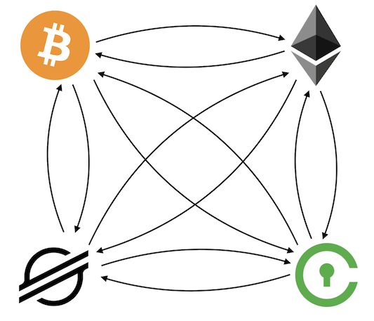

<p align="center">
  
</p>

# GNNTrade

Forecasting cryptocurrency price movements with graph neural networks.

## Summary

This repo contains all code necessary for training a message passing graph neural network to forecast price crypto price movements, and includes scripts for:

1. Environment configuration
2. Data acquisition via [ccxt](https://github.com/ccxt/ccxt)
3. Pre-processing
4. Training/deployment

Sections 3 and 4 are integrated and controlled via a [configuration script](src/configuration.py). See details in the following sections.


## Setup

Note: These instructions and setup scripts assume execution in Linux or MacOS environments with conda (for conda installation, see their [install page](https://docs.conda.io/en/latest/miniconda.html)), and as such may require some tweaking for full functionality on Windows.

Step one: clone this repo:

```{shell}
$ git clone https://github.com/MattsonThieme/GNNTrade.git
$ cd GNNTrade
```

Then run the following setup script to build and configure a new conda environment:

```{shell}
$ bash env_setup.sh
```

This will create a new environment named `gnntrade`. Activate the conda environment, and we're ready to begin working.

```{shell}
$ conda activate gnntrade
```

## Data Acquisition

For this project, I have included sample data so you can get started right away, but if you would like to collect your own data on an asset I haven't included, or at a frequency I haven't sampled, or just a larget dataset (GitHub limits file sizes to 100Mb) a script is available in [data/collector.py](data/collect.py). 

To run the collection script, I recommend using a terminal multiplexer like [tmux](https://www.hamvocke.com/blog/a-quick-and-easy-guide-to-tmux/) on a small AWS instance. Edit parameters at the top of the file including 'symbol' and 'delay' then run:

```{shell}
$ python collect.py
```

This will create and continuously append a file with prices for all assets in asset_list once every sampling period ("target" seconds). We'll see in subsequent sections how to use this new file for training (it's as simple as setting a single variable in the configuration file).

## Training

Change directory into `src/`:

```{shell}
$ cd src/
```

This folder contains only two files: `configuration.py` and `gnn.py`. Within the `configuration.py` file, you will find all the most important training parameters. 

The most important training parameters are contained in `configuration.py`. Here, you will be able to edit parameters like batch size, edge indices (defining connections between assets), and the number of historical price movements to learn with at each step. However, we don't need to edit anything to get started. All necessary data is already contained in [data/](../data/), so we will get right into training.

To initiate training, ensure that you are in the `(rltrade)` environment, and run:

```{shell}
$ python gnn.py
```

When training has begun (data processing takes a few seconds), a tqdm progress bar will appear. After each epoch, a brief report of the training loss will appear.

```{shell}
100%|████████████████████████████████████████████████████████████| 284/284 [18:47<00:00,  3.97s/it]
Epoch 1/10, Avg loss: 0.004397264795942915
``` 

Here, we can see the average loss over that epoch, as well as the time it took to processs the entire epoch and time per iteration.

After each epoch, the policy network will be saved in the `src/` directory.

That's it! Tweak the model parameters and see what helps you better predict price movements.

:bangbang: Disclaimer :bangbang: The sample dataset provided is **very small** (GitHub limits file sizes to 100Mb). Before using this model to inform trading decisions, please collect more data using the provided scripts and validate the model over a longer time period. We claim no responsibility for any losses incurred when deloying this model.

## Model

Now that the model is up and running, here are some details about what is going on under the hood. First, it is important to understand what the model is doing.

<p align="center">
  
</p>

In the above figure, consider each colored box under each asset to be the ask price for that asset at that timestep. We assign to each node (shown in the image below) an embedding composed of the concatenation of price histories over some range (specified in [configuration.py](src/configuration.py)). We are then trying to predict the values of each of those assets some time down the line. 


The model update methodology is shown above. First, we structure the model graphically, assigning each node the embeddings mentioned above. For each node, we pass messages (embeddings) through intervening message networks and aggregate them into a message vector. This message vector is then combined with a transformation of the existing node embedding and fed into the update network, which produces the final embedding which represents the predicted price for that asset.

## I/O

As touched on in the previous section, this model ingests historical prices for all assets in asset_list and outputs a final value for each asset. Accuracy is calculated as the percentage of predictions that move in the right direction (relative to the current price).


